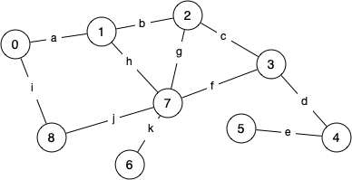
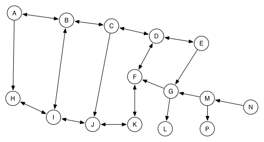
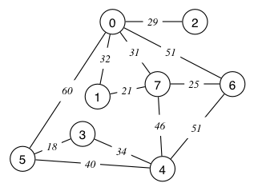
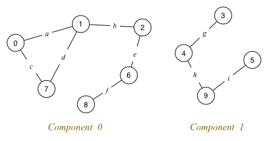

Graphs (W7 Tute)
==========
-----
###Definitions:
- Cycle: Sequence of connected edges that begins and ends at the same node.
- Clique: Complete connected subgraph of a graph
- Edge: Connection between one node and another (can be the same node)
- Degree:
    - Undirected Graphs: Equal to the number of edges connecting it to something else.
    - In-degree: Number of incoming edges to node
    - Out-degree: Number of outgoing edges from node
###Questions:


Q1.

- How many edges does it have? 11 edges
- How many cycles are there in the graph? 6
- How many cliques are there in the graph? 2
- What is the degree of each vertex? 
    - 1: 3
    - 7: 5
    - 5: 1
    - So on...
- How many edges in the longest path from 5 to 8?
    - e -> d -> c -> g -> h -> a -> i

Q2.

Think of Facebook as a graph:
- Vertices: every user (user profiles)
- Edges: Friends
- Directional Edges? No, if you are a friend of someone, they are a friend of you.
- Vertex Degree: Number of friends a user has.
- How to suggest potential friends?
    - Breadth first search, suggest closest related people who are not friends.

Q3.

a. Path D -> L: D -> E -> G -> L
b. Path J -> A: J -> I -> B -> A
c. Path A -> M: No connections
d. Path M -> H: M -> G -> F -> K -> J -> I -> H

Q4.

Adjacency Matrices:
Are 2d arrays that if array[m][n] is true, there is edge between node m and n
```
i)
[0 1 0 0 0 1]
[1 0 0 0 0 1]
[0 0 0 0 0 1]
[0 0 0 0 0 1]
[0 0 0 0 0 1]
[1 1 1 1 1 0]
Undirected graphs produce symmetrical arrays about the diagonal.
ii)
[0 1 0 0 0 0]
[0 0 0 0 0 1]
[0 0 0 0 0 0]
[0 0 0 0 0 1]
[0 0 0 0 0 0]
[1 1 1 1 1 0]
```
Adjacency Lists:
Single array of pointers to lists, where lists are a series of connected nodes
0: -> 1 -> NULL
1: NULL
2: -> 1 -> 0 -> NULL
```
i)
0: 1 -> 5 -> NULL
1: 0 -> 5 -> NULL
2: 
3:
4:
5:
ii)

```
Q5.
How is the adjacency matrix for a directed graph different to that for an undirected graph?
- Undirected graph: symmetrical about the diagonal.
Advantages of adjacency list:
- If graph has few edges, we dont have to use a lot of space. Space complexity better than matrix.
Advantages of adjacency matrix
- Edge access is O(1) time since we are accessing an array.

Q6.

Show results of BFS and DFS starting from 0
DFS
```
 #       Printed    Visited             Queue (front at left)
 0       -          -                   3
 1       3          3                   4 5
 2       4          3 4                 5 6 7
 3       5          3 4 5               6 7 0
 4       6          3 4 5 6             7 0 0 7
 5       7          3 4 5 6 7           0 0 7 0 1
 6       0          3 4 5 6 7 0         0 7 0 1 1 2
 7       1          3 4 5 6 7 0 1       1 2
 8       2          3 4 5 6 7 0 1 2     -
```
BFS
```
 #       Printed    Visited             Queue (front at left)
 0       -          -                   0
 1       0          0                   1 2 5 6 7
 2       1          0 1                 2 5 6 7 7
 3       2          0 1 2               5 6 7 7
 4       5          0 1 2 5             6 7 7 3 4
 5       6          0 1 2 5 6           7 7 3 4 3 7
 6       7          0 1 2 5 6 7         7 3 4 3 7 4
 7       3          0 1 2 5 6 7 3       4 3 7 4 4
 8       4          0 1 2 5 6 7 3 4     3 7 4 4
```
Q7.
Difference Between Connected Graph and Complete Graph?
- Complete Graph: A graph where every node is connected to every other node.
- Connected Graph: A graph where every node is reachable via some path from each other node in the graph.
- Clique: Complete subgraph
- Component: Connected subgraph

Q8.

Connected Components:
```
cc[] = {0, 0, 0, 1, 1, 1, 0, 0, 0, 1}
```
1. Bridges: An edge such that removing it would create a new component. Edge cannot be part of a cycle.
2. Show cc if edge d is removed
```
cc[] = {0, 0, 0, 1, 1, 1, 0, 0, 0, 1}
```
3. Show cc if edge b is removed
```
cc[] = {2, 2, 0, 1, 1, 1, 0, 2, 0, 1}
```
Q9.
Euler Paths/Tours: A sequence of every edge in the graph such that each edge is visited exactly once. Tour starts and ends on same node.
Hamilton Paths/Tours: A sequence of every node in the graph such that each node is visited exactly once. Tour starts and ends on same node. 
Q10.
Code
Q11.
Example of Hamilton path in graph:
4-0-1-5-6-2-3
There is no hamilton tour
We must add an edge between 3-4 to get the tour:
0-1-5-6-2-3-4-0

