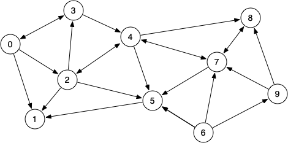
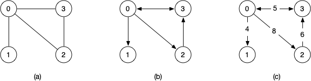
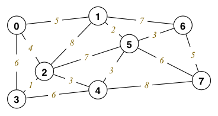
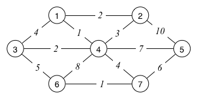
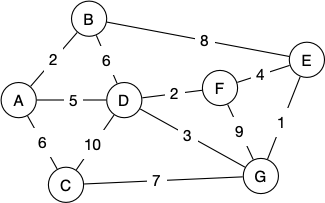

Week08 Tutorial
======
Q1.

1. Which vertices are reachable from vertex 0?
0: (1 2 3 4 5 7 8)
2. Which vertices are reachable from vertex 1?
1: (no connections)
3. Which vertices are reachable from vertex 5?
5: (1)
4. Which vertices are reachable from vertex 6?
6: (1 2 3 4 5 7 8 9)

Q2. Function

Q3.

Give the adjacency matrices for these graphs:
Graph a)
```
[0 1 1 1]
[1 0 0 0]
[1 0 0 1]
[1 0 1 0]
```
Graph b)
```
[0 1 1 1]
[0 0 0 0]
[0 0 0 0]
[1 0 1 0]
```
Graph c)
```
[0 4 8 5]
[0 0 0 0]
[0 0 0 0]
[5 0 6 0]
```

Q4.
Dijkstras: Find the shortest distance to all other nodes
from a particular source node.

Initial sets
```
vSet = { 0, 1, 2, 3, 4, 5, 6, 7 }
dist = [0, inf, inf, inf, inf, inf, inf, inf]
pred = [-1,-1,-1,-1,-1,-1,-1,-1]
```
Step 1
```
vSet = { 1, 2, 3, 4, 5, 6, 7 }
dist = [0, 5, 4, 6, inf, inf, inf, inf]
pred = [-1,0,0,0,-1,-1,-1, inf]
```
Step 2
```
vSet = { 1, 3, 4, 5, 6, 7 }
dist = [0, 5, 4, 5, 7, 11, inf, inf]
pred = [-1,0,0,2,2,2,-1,-1]
```
Step 3
```
vSet = { 3, 4, 5, 6, 7 }
dist = [0, 5, 4, 5, 7, 7, 12, inf]
pred = [-1,0,0,2,2,1,1,-1]
```
Step 4
```
vSet = { 4, 5, 6, 7 }
dist = [0, 5, 4, 5, 7, 7, 12, inf]
pred = [-1,0,0,2,2,1,1,-1]
```
Step 5
```
vSet = { 5, 6, 7 }
dist = [0, 5, 4, 5, 7, 7, 12, 15]
pred = [-1,0,0,2,2,1,1,4]
```
Step 6
```
vSet = { 6, 7 }
dist = [0, 5, 4, 5, 7, 7, 10, 13]
pred = [-1,0,0,2,2,1,5,5]
```
Step 7
```
vSet = { 7 }
dist = [0, 5, 4, 5, 7, 7, 10, 13]
pred = [-1,0,0,2,2,1,5,5]
```
Step 8
```
vSet = {  }
dist = [0, 5, 4, 5, 7, 7, 10, 13]
pred = [-1,0,0,2,2,1,5,5]
```

What is the shortest path from 7 to 0 (What the distance is):
Path is 0->1->5->7, length is 13

Q5.

Kruskals
```c
typedef Graph MSTree;

MSTree kruskalFindMST(Graph g)
{
	MSTree mst = GraphNew(); // MST initially empty
	Edge eList[g->nV]; // sorted array of edges
	edges(eList, g->nE, g);
	sortEdgeList(eList, g->nE);
	for (int i = 0; mst->nE < g->nV - 1; i++) {
		Edge e = eList[i];
		GraphAddEdge(mst, e);
		if (GraphHasCycle(mst)) GraphRemoveEdge(mst, e);
	}
	return mst;
}
```
Kruskals algorithm: Create an MST (MST minimum cumulative weight of edges such that there are no cycles and every node is reachable via every other node int he graph)

Best Case: O(N), N-1 edges
Worst Case: O(E), E is number of edges in graph

Q6.


1. Start from any vertex v and empty MST
2. Choose edge not already in MST, satisfying
        incident on a vertex s already in MST
        incident on a vertex t not already in MST
        with minimal weight of all such edges
3. Add chosen edge to MST
4. Repeat until MST covers all vertices

Perform Prim's algorithm on the above graph:
```
Start at A
Expand A
Connect edge A-B (W:2)
Expand B
Connect Edge A-D (W:5)
Expand D
Connect Edge D-F (W:2)
Expand F
Connect D-G (W:3)
Expand G 
Conenct G-E (W:1)
Expand E
Connect A-C (W:6)
Expand C
```
